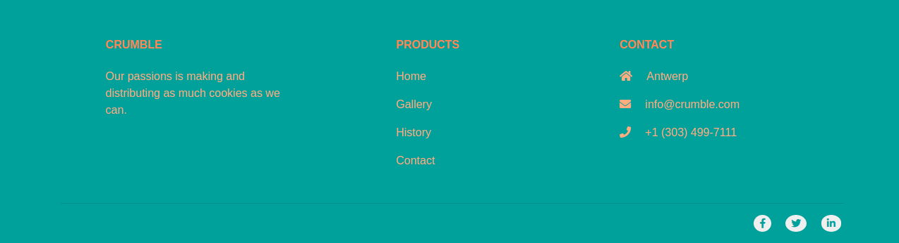

# Final Project: Crumble

For our Final project we came up with a cookie baking company. So We made a one page site for this company. The one page site is divided in the following 4 sections:

## 1. Banner/Header
Some awesome header with a beautifull background picture
### Preview
[Click here for the Banner/Header section preview]()
## 2. Gallery
Here you find some awesome picture of our cookies with a short description.
### Preview
[Click here for the Gallery section preview]()
## 3. History
In this section you will find a short story how our company was built.
### Preview
[Click here for the History section preview]()
## 4 Contact

The contact section is divided in 3 differents sections.
1. The opening hour section: this provides a table with the opening hours and also a picture next to it.
2. Adress section: this shows the location of the company on a 100% width google map.

3. Contact form section: here you can fill in a message in case you want to get in contact with the company owner.

### Preview
[Click here for the Contact section preview](https://laurensnelen.github.io/Crumble/Contact.html)

## Footer

In the first row of the footer. We have 3 columns next to eachother

1. Name of company
2. Products
3. Contact information

and the last row has some icons made with fontawesome that redirects you to facebook twitter or linkedin.
### Preview Picture

